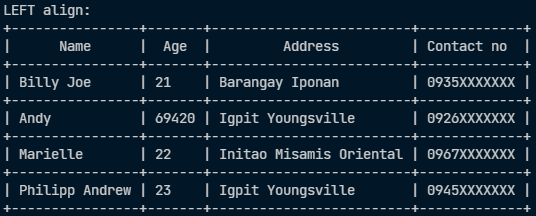
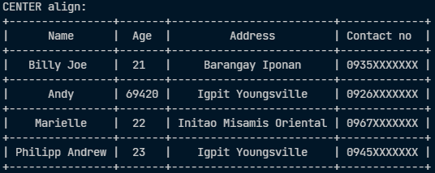
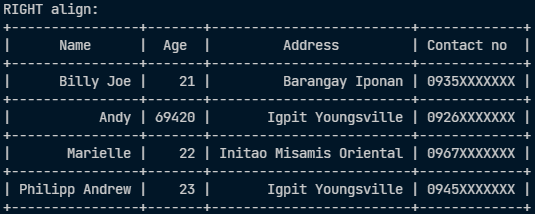

<div align="center">
  <h1>Pretty Print Java</h1>
</div>

**🔥 Description** <br>

A simple table printer made using Java. <br>

# 📄 SAMPLE USAGE 

```Java
public class Test
{
    public static void main(String[] args) throws InvalidTableError
    {

        String[] model  = {"Name","Age","Address","Contact no"};

        String[][] data = {
            {"Billy Joe"      , "21"    , "Barangay Iponan"         , "0935XXXXXXX"},
            {"Andy"           , "69420" , "Igpit Youngsville"       , "0926XXXXXXX"},
            {"Marielle"       , "22"    , "Initao Misamis Oriental" , "0967XXXXXXX"},
            {"Philipp Andrew" , "23"    , "Igpit Youngsville"       , "0945XXXXXXX"}
        };

        PrettyPrint pp = new PrettyPrint(model, data, Alignment.RIGHT);
        
        System.out.println("RIGHT align:");
        System.out.println(pp);

        // pp.pprint();

    }
}
```
# 📷 SAMPLE SCREENSHOTS
<div align="left" style="display:inline;">
    
    
    
</div>
